<div align="center">

```
 ██████╗ ██████╗ ██████╗ ███████╗██╗   ██╗██╗███████╗
██╔════╝██╔═══██╗██╔══██╗██╔════╝██║   ██║██║██╔════╝
██║     ██║   ██║██║  ██║█████╗  ██║   ██║██║███████╗
██║     ██║   ██║██║  ██║██╔══╝  ╚██╗ ██╔╝██║╚════██║
╚██████╗╚██████╔╝██████╔╝███████╗ ╚████╔╝ ██║███████║
 ╚═════╝ ╚═════╝ ╚═════╝ ╚══════╝  ╚═══╝  ╚═╝╚══════╝
```

<!-- Animated typing tagline -->
<a href="https://codevis.vercel.app">
  
</a>

<br/>

[](https://reactjs.org/)
[](https://vitejs.dev/)
[](https://groq.com/)
[](https://supabase.com/)

[](https://isocpp.org/)
[](https://python.org/)
[](https://codevis.vercel.app)
[](LICENSE)

[](https://github.com/Prajwal18py/codevis/stargazers)
[](https://github.com/Prajwal18py/codevis/network)

<br/>

> **CODEVIS** is not just another coding tool.
> It's a full AI-powered learning arena — analyze code, learn OOP, visualize algorithms,
> battle friends in real-time, and get AI-judged. All in one dark-mode beast. 🔥

<br/>

[🚀 **Live Demo**](https://codevis.vercel.app) &nbsp;·&nbsp;
[⚙️ **Setup**](#%EF%B8%8F-installation) &nbsp;·&nbsp;
[🗂️ **Structure**](#%EF%B8%8F-project-structure) &nbsp;·&nbsp;
[📸 **Screenshots**](#-screenshots) &nbsp;·&nbsp;
[⚔️ **Battle Mode**](#️-group-battle-mode)

</div>

<!-- Animated divider -->


## 🌟 What Makes CODEVIS Different?

<div align="center">

```
┌─────────────────────────────────────────────────────────────────────┐
│                                                                     │
│   📚 Learn  →  🔍 Analyze  →  🎮 Practice  →  ⚔️ Battle  →  🏆 Win │
│                                                                     │
│        The complete CS learning loop — all in one platform          │
│                                                                     │
└─────────────────────────────────────────────────────────────────────┘
```

</div>

| | Other Tools | **CODEVIS** |
|---|---|---|
| AI code explanation | ✅ Basic | ✅ Deep walkthrough + analogies + dry run |
| OOP Analysis | ❌ | ✅ 12 concepts auto-detected, SVG class diagram |
| Algorithm Visualizer | ✅ Basic bars | ✅ 14+ algos, step nav, complexity charts, C++/Python |
| Learn vs Practice | Separate tools | ✅ Same platform |
| Compete with friends | ❌ | ✅ Live 1v1 battles, AI judge, 100 problems |
| Code execution | ❌ | ✅ Real C++ / Python via Piston API |
| Themes | 1 | ✅ 4 (Dark / Light / Dracula / Nord) |

<!-- Animated divider -->


## 📸 Screenshots

<div align="center">

### 🔐 Login Page
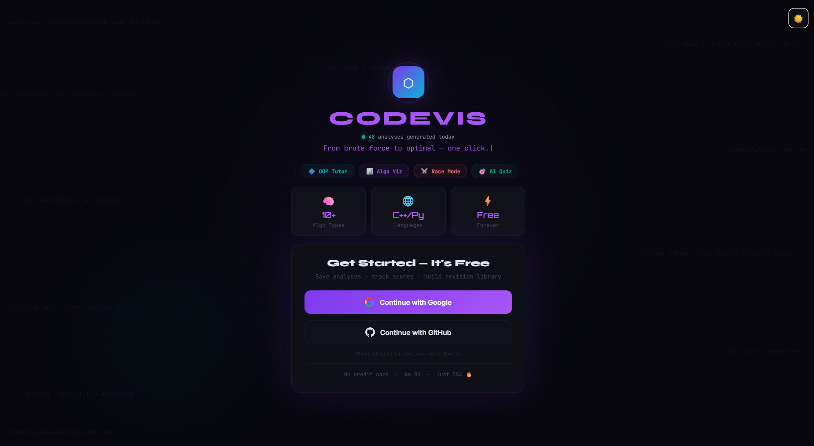

<br/>

### 📊 Dashboard
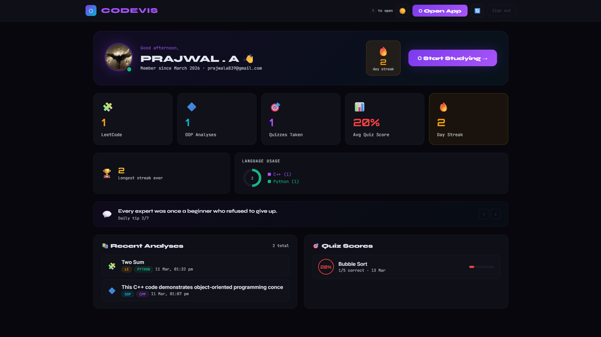

<br/>

### 🧩 LeetCode AI Tutor
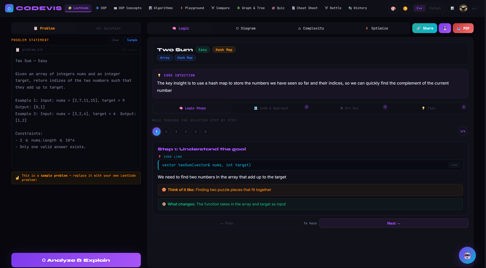

<br/>

### 🔷 OOP Analyzer
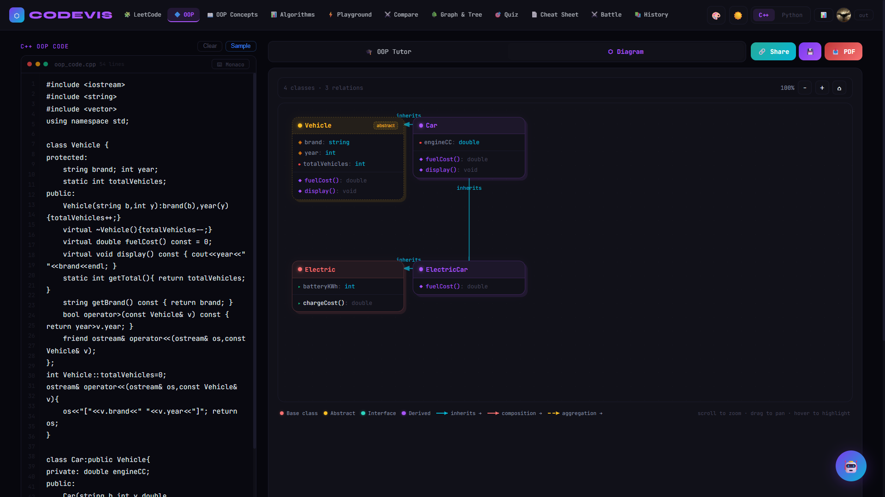

<br/>

### 📖 OOP Concepts Reference
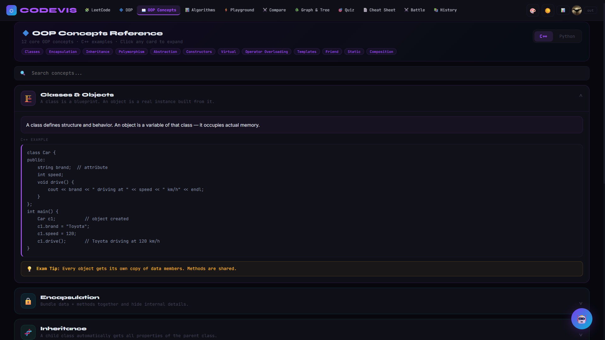

<br/>

### 📊 Algorithm Visualizer
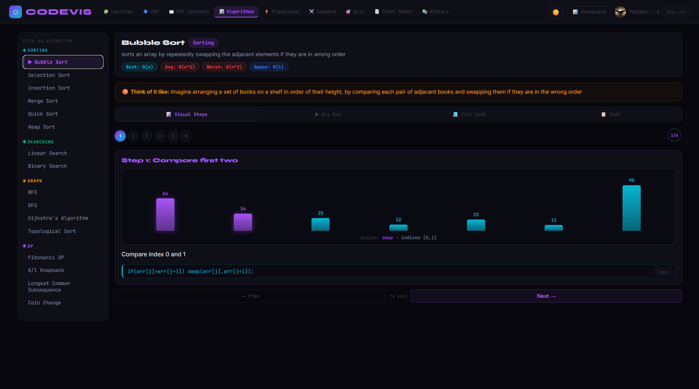

<br/>

### 🌳 Graph & Tree Visualizer
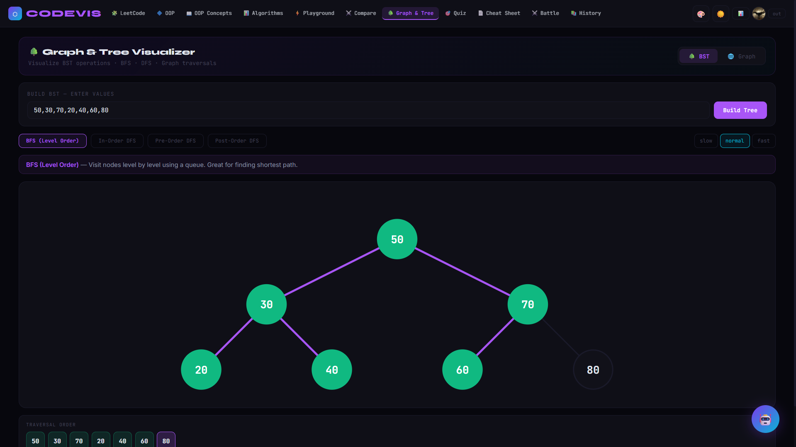

<br/>

### ⚔️ Group Battle Mode — Lobby
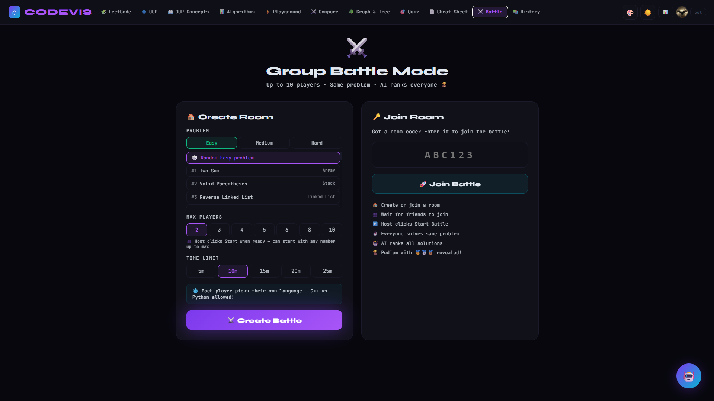

<br/>

### ⚔️ Group Battle Mode — Arena
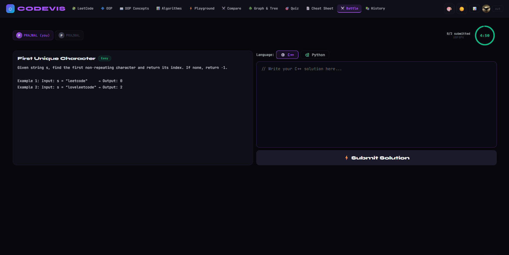

<br/>

### 🎯 AI Quiz
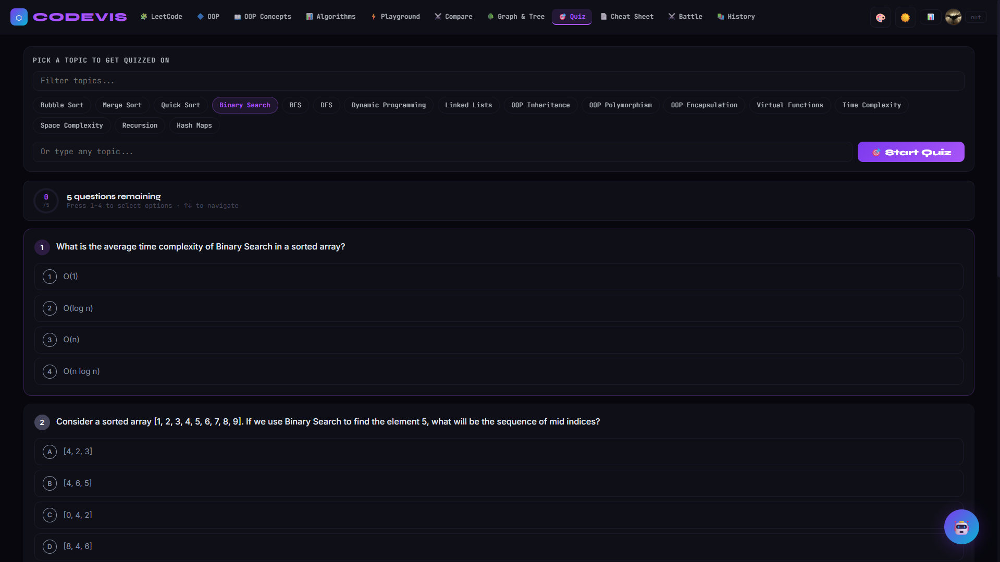

<br/>

### 📄 Cheat Sheet
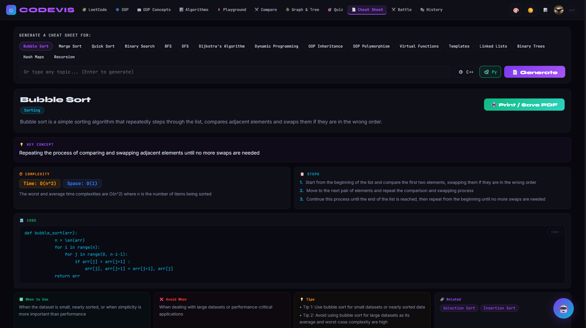

<br/>

### 🔗 Shared Analysis View
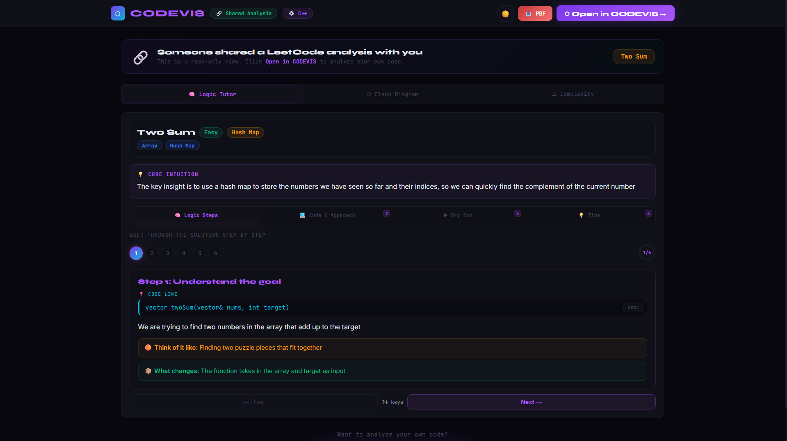

</div>

<!-- Animated divider -->


## ✨ Feature Deep Dives

<br/>

### 🧩 LeetCode AI Tutor

> *Paste a problem. Get a full breakdown. Actually understand it.*

```
Input:  Problem statement + your solution
Output: Step-by-step logic  →  Dry run table  →  Complexity chart  →  PDF
```

- 🔍 AI breaks down your approach with **real-world analogies**
- ⚡ Brute force vs Optimal — side-by-side
- 📊 Visual dry run table for any input
- 🧮 Time + Space complexity with charts
- 🚨 Common mistakes + tricky edge cases
- 📥 Export as **PDF revision sheet** in one click

<br/>

---

### 🔷 OOP Analyzer *(C++ / Python)*

> *Paste any OOP code. CODEVIS tells you exactly what's happening under the hood.*

```
Input:  C++ or Python OOP code
Output: Concept detection  →  Object lifecycle  →  Memory trace  →  SVG diagram
```

- 🎯 Detects all **12 OOP concepts** automatically (no guessing)
- 🪜 Step-by-step object creation walkthrough
- 🧠 Memory state visualization at every step
- 🗺️ Interactive **SVG class diagram** — zoom + pan
- 📈 OOP coverage progress ring (%)
- 📥 Export as **PDF revision sheet**

<details>
<summary>📋 All 12 OOP Concepts Detected</summary>

| # | Concept | Detected In |
|---|---|---|
| 1 | Classes & Objects | C++ / Python |
| 2 | Encapsulation | C++ / Python |
| 3 | Inheritance | C++ / Python |
| 4 | Polymorphism | C++ / Python |
| 5 | Abstraction | C++ / Python |
| 6 | Constructors & Destructors | C++ / Python |
| 7 | Virtual Functions | C++ |
| 8 | Operator Overloading | C++ / Python |
| 9 | Templates / Generics | C++ / Python |
| 10 | Friend Functions | C++ |
| 11 | Static Members | C++ / Python |
| 12 | Composition | C++ / Python |

</details>

<br/>

---

### ⚔️ Group Battle Mode *(Star Feature)*

> *Code. Compete. Win. — Real-time 1v1 battles with AI judging.*

```
Create Room → Share 6-digit code → Friend joins → Battle starts → AI judges → Winner declared
```

```
┌──────────────┐     ┌──────────────┐     ┌──────────────┐
│  👤 Player 1 │     │  🤖 Groq AI  │     │  👤 Player 2 │
│  C++ / Py    │ ──► │    Judge     │ ◄── │  C++ / Py    │
│  ⏱️ 5–15 min │     │  Both codes  │     │  ⏱️ 5–15 min │
└──────────────┘     └──────┬───────┘     └──────────────┘
                            │
                     ┌──────▼───────┐
                     │  🏆 Winner!  │
                     │  Score shown │
                     └──────────────┘
```

- 🎮 **100 curated problems** — 40 Easy · 39 Medium · 21 Hard
- 🌐 **Up to 10 players** per room
- 🔀 Each player picks **their own language** (C++ or Python)
- ⏱️ Timer: 5 / 10 / 15 minutes
- ✅ Code **actually executes** via Piston API
- 🤖 **Groq AI judges** both solutions — not just test cases
- 📡 Realtime sync via **Supabase Realtime** websockets

<br/>

---

### 📊 Algorithm Visualizer

> *Watch algorithms run. Step forward. Step back. Actually learn.*

- 🎬 **14+ algorithms** — Sorting, Searching, Graph, DP
- 🔄 **C++ / Python toggle** on code view — same algo, both languages
- ▶️ Step-by-step **animated bar chart**
- ⌨️ Keyboard navigation (`←` `→` arrow keys)
- 📖 Real-world analogy per algorithm
- 📊 Full complexity breakdown + pros/cons

<details>
<summary>📋 All Algorithms</summary>

**Sorting:** Bubble · Selection · Insertion · Merge · Quick · Heap · Radix · Counting

**Searching:** Binary Search · Linear Search

**Graph:** BFS · DFS · Dijkstra · Bellman-Ford

**DP:** Fibonacci · Knapsack

</details>

<br/>

---

### 🌳 Graph & Tree Visualizer

- 🌲 **BST Mode** — insert values, watch the tree build
- 🔄 4 traversals: BFS, In-order, Pre-order, Post-order — animated
- 🖱️ **Graph Mode** — drag nodes, add/remove edges interactively
- 🎯 BFS & DFS with per-step node highlighting
- ⚡ Preset graphs: Sample Tree + Cycle Graph

<br/>

---

### 🎯 AI Quiz + 📄 Cheat Sheet

**Quiz:**
- AI generates **5 fresh MCQs** on any CS topic, every time
- Scores + streaks saved to dashboard
- ⌨️ Keyboard shortcuts `1–4` for speed
- 20+ preset topics (or type your own)

**Cheat Sheet:**
- Type any topic → AI generates a full revision sheet
- Syntax-highlighted code blocks
- One-click **print / save as PDF** with CODEVIS branding

<br/>

---

### 🤖 Floating AI Chat

> *Context-aware AI assistant — on every single tab.*

- 💬 Knows what **mode you're currently in** — answers stay relevant
- 🔁 Multi-turn conversation (last 10 messages retained)
- ⚡ Quick suggestion buttons per mode
- 🔴 Unread message badge
- Powered by **Groq LLaMA 3.3 70B** — ~1s response

<!-- Animated divider -->


## 🛠️ Tech Stack

<div align="center">

<!-- Animated skill icons -->


<br/><br/>

| Layer | Technology | Why |
|---|---|---|
| ⚛️ Frontend | **React 18 + Vite 5** | Blazing fast HMR + modern JSX |
| 🎨 Styling | **CSS-in-JS + 4-theme system** | Dark / Light / Dracula / Nord |
| 🤖 AI Engine | **Groq API — LLaMA 3.3 70B** | ~1–3s AI responses |
| 💻 Code Execution | **Piston API** | Run C++ / Python in-browser |
| ✏️ Code Editor | **Monaco Editor** | VS Code experience, in the browser |
| 🔐 Auth | **Supabase Auth** | Google + GitHub OAuth |
| 🗄️ Database | **Supabase PostgreSQL** | History, scores, streaks |
| 📡 Realtime | **Supabase Realtime** | Battle Mode websockets |
| 🚀 Deployment | **Vercel** | Zero-config CI/CD |

</div>

<!-- Animated divider -->


## 🗂️ Project Structure

```
codevis/
├── .env                          # API keys — never commit!
├── .env.example                  # Template for contributors
├── index.html
├── package.json
├── vite.config.js
├── supabase_schema.sql           # Main DB schema
├── battle_schema.sql             # ⚔️ Battle Mode tables
├── screenshots/                  # 📸 All 12 screenshots
│
├── backend/
│   └── codevis_backend.cpp       # C++ OOP backend (all 12 concepts)
│
└── src/
    ├── main.jsx                  # Entry point + ThemeProvider
    ├── Root.jsx                  # Auth router
    ├── App.jsx                   # Main app shell + state
    │
    ├── components/
    │   ├── UI.jsx                # Shared reusable components
    │   ├── Editors.jsx           # Monaco editor toggle
    │   ├── AuthModal.jsx         # Login modal
    │   └── AIChat.jsx            # Floating AI chat bubble
    │
    ├── pages/
    │   ├── LoginPage.jsx         # Landing + login
    │   ├── Dashboard.jsx         # Stats, streaks, charts
    │   └── SharedView.jsx        # Public shared analysis (no login)
    │
    ├── tabs/
    │   ├── LCTutorTab.jsx        # LeetCode AI Tutor
    │   ├── OOPTutorTab.jsx       # OOP code analyzer
    │   ├── OOPConceptsTab.jsx    # 12 OOP concepts reference
    │   ├── ClassDiagram.jsx      # Interactive SVG class diagram
    │   ├── AlgoTab.jsx           # Algorithm visualizer
    │   ├── Playground.jsx        # Custom sort playground
    │   ├── Comparison.jsx        # Algorithm race mode
    │   ├── GraphTreeTab.jsx      # BST + Graph visualizer
    │   ├── BattleTab.jsx         # ⚔️ 1v1 Battle Mode
    │   ├── QuizTab.jsx           # AI MCQ quiz
    │   ├── CheatSheet.jsx        # AI cheat sheet + PDF
    │   ├── HistoryTab.jsx        # Saved analyses
    │   ├── ComplexityTab.jsx     # Complexity visuals
    │   ├── DryRun.jsx            # Dry run table
    │   └── LogicTab.jsx          # Logic steps
    │
    └── utils/
        ├── groq.js               # Groq API + all prompt builders
        ├── supabase.js           # Supabase client + helpers
        ├── battle.js             # ⚔️ Battle logic + 100 problems
        ├── piston.js             # Code execution API wrapper
        ├── generatePDF.js        # PDF export
        ├── share.js              # Shareable link encode/decode
        ├── theme.js              # Theme definitions
        └── ThemeContext.jsx      # useTheme() hook
```

<!-- Animated divider -->


## ⚙️ Installation

### Prerequisites

- **Node.js 18+**
- [Groq API key](https://console.groq.com/) — free tier available
- [Supabase](https://supabase.com/) project — free tier available

### Step 1 — Clone

```bash
git clone https://github.com/Prajwal18py/codevis.git
cd codevis
```

### Step 2 — Install

```bash
npm install
```

### Step 3 — Environment Variables

```bash
cp .env.example .env
```

```env
VITE_GROQ_API_KEY=your_groq_api_key_here
VITE_SUPABASE_URL=https://yourproject.supabase.co
VITE_SUPABASE_ANON_KEY=your_supabase_anon_key_here
```

### Step 4 — Supabase Setup

In your **Supabase SQL Editor**, run these in order:

```
1. supabase_schema.sql   ← main tables
2. battle_schema.sql     ← battle mode tables
```

### Step 5 — Run

```bash
npm run dev
# → http://localhost:5173
```

<!-- Animated divider -->


## 🚀 Deploy to Vercel

```bash
git add .
git commit -m "🚀 CODEVIS v5"
git push origin main
```

1. Go to [vercel.com](https://vercel.com) → **Add New Project** → Import `codevis`
2. Add your 3 environment variables
3. Hit **Deploy** ✅
4. In Supabase → **Auth → Redirect URLs**, add:

```
https://codevis.vercel.app/**
http://localhost:5173/**
```

<!-- Animated divider -->


## 📊 By The Numbers

<div align="center">

| Metric | Value |
|---|---|
| 🤖 AI Modes | **11** |
| ⚔️ Battle Problems | **100** *(40 Easy · 39 Medium · 21 Hard)* |
| 👥 Max Players per Room | **10** |
| 📖 OOP Concepts Covered | **12** *(C++ + Python)* |
| 📊 Algorithms Visualized | **14+** |
| 🎨 Themes | **4** *(Dark / Light / Dracula / Nord)* |
| ⚛️ React Components | **25+** |
| 🧠 AI Model | **LLaMA 3.3 70B via Groq** |
| ⚡ Avg AI Response Time | **~1–3 seconds** |
| 🔐 Auth Providers | **Google + GitHub** |
| 📡 Realtime Tech | **Supabase Websockets** |

</div>

<!-- Animated divider -->


## 🗺️ Roadmap

### ✅ Shipped

- [x] 🧩 LeetCode AI Tutor
- [x] 🔷 OOP Analyzer (C++ + Python)
- [x] 📖 OOP Concepts Reference (12 concepts)
- [x] 📊 Algorithm Visualizer (14+ algos)
- [x] 🌳 Graph & Tree Visualizer
- [x] ⚔️ Group Battle Mode (100 problems, realtime, AI judge)
- [x] 🤖 Floating AI Chat (context-aware, multi-turn)
- [x] 🔗 Shareable analysis links
- [x] 📱 Mobile responsive layout
- [x] 🎨 4 Themes (Dark / Light / Dracula / Nord)
- [x] ⌨️ Monaco Editor (VS Code in browser)
- [x] 📊 Dashboard (streaks, sparklines, donut chart)
- [x] ⚡ Piston live code execution (C++ + Python)

### 🔜 Coming Soon

- [ ] 🏆 Battle leaderboard (global rankings)
- [ ] 🔍 Code similarity detector (ML-powered)
- [ ] 📈 Difficulty predictor (ML model)
- [ ] 🎯 Personalized problem recommender
- [ ] 🌐 Java + JavaScript language support

<!-- Animated divider -->


## 🤝 Contributing

PRs welcome. If you find a bug or want a feature — open an issue first so we can discuss.

```bash
# Fork → Clone → Branch → Code → PR
git checkout -b feature/your-feature-name
```

## 📄 License

MIT © [Prajwal A](https://github.com/Prajwal18py) — use it, fork it, build on it.

<div align="center">

<br/>

**Built with 🔥 by [Prajwal A](https://github.com/Prajwal18py)**

*If CODEVIS helped you crack an interview, ace an exam, or beat your friend in battle — drop a ⭐*

[](https://github.com/Prajwal18py/codevis)

<br/>

```
          Learn smarter. Code faster. Battle harder.
```

</div>